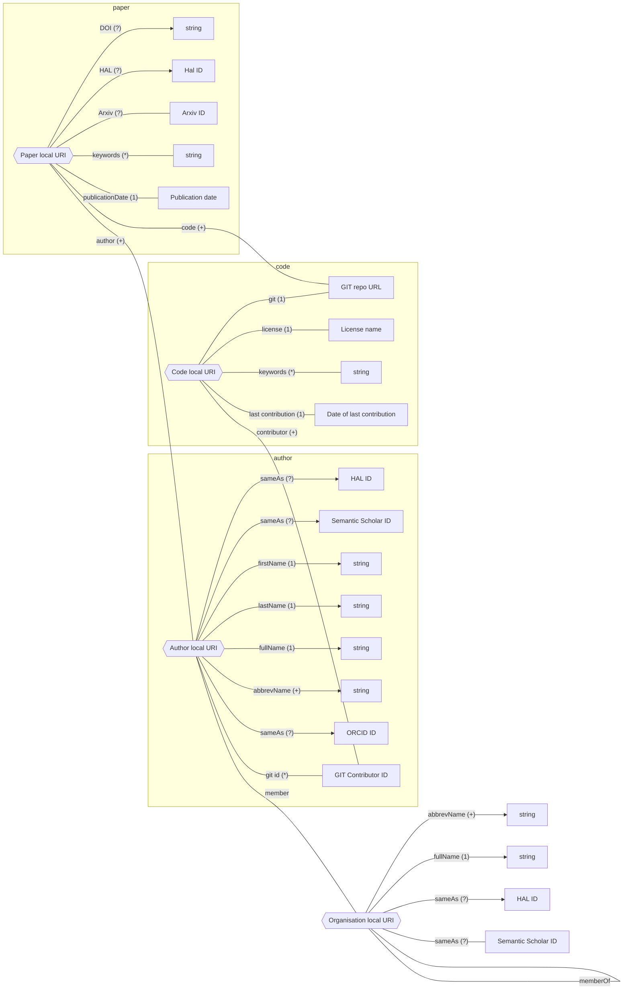

# ResearchTeamProjectFinder

The aim of this project is to create a tool able to use the different APIs available to find the public Git repositories of INRIA research teams. Further development will aim to extend this approach to all european research teams.

## Data

### Semantic Scholar

latest version: 2025-02-18
https://api.semanticscholar.org/datasets/v1/release/2025-02-18/dataset/papers

Waiting for an API key

### HAL

SPARQL endpoint: https://data.hal.science/doc/sparql

Research team list:

```sparql
PREFIX org: <http://www.w3.org/ns/org#>
PREFIX skos: <http://www.w3.org/2004/02/skos/core#>
PREFIX rdfs: <http://www.w3.org/2000/01/rdf-schema#>
SELECT DISTINCT ?org ?label ?alt{
  ?org a <http://www.w3.org/ns/org#OrganizationalUnit> ;
  	skos:prefLabel ?label ;
   skos:altLabel ?alt ;
   org:classification <https://data.archives-ouvertes.fr/vocabulary/StructureTypeResearchteam> .
}
```

List of the names of team members:

```sparql
PREFIX org: <http://www.w3.org/ns/org#>
PREFIX skos: <http://www.w3.org/2004/02/skos/core#>
PREFIX rdfs: <http://www.w3.org/2000/01/rdf-schema#>
PREFIX foaf: <http://xmlns.com/foaf/0.1/>
PREFIX halschema: <http://data.archives-ouvertes.fr/schema/>

SELECT DISTINCT ?authorName {
  ?org org:classification <https://data.archives-ouvertes.fr/vocabulary/StructureTypeResearchteam> ;
  	skos:prefLabel ?teamLabel ;
   skos:altLabel ?altTeamLabel .

  ?author halschema:structure ?org ;
      foaf:name ?authorName .
}
ORDER BY DESC(?nom)
LIMIT 50
```

### Paper with code

Dowlnload links: https://paperswithcode.com/about

### Code archive

### ORCID

XML Bulk files:
https://info.orcid.org/documentation/integration-guide/working-with-bulk-data/

Conversion from XML to JSON:
https://github.com/ORCID/orcid-conversion-lib

## Knowledge Graph

Legend:
- `(?)` 0 or 1
- `(*)` 0 or more
- `(+)` at least 1
- `(3)` exactly 3
- `(3+)` 3 or more
- `(3,6)` between 3 and 6

