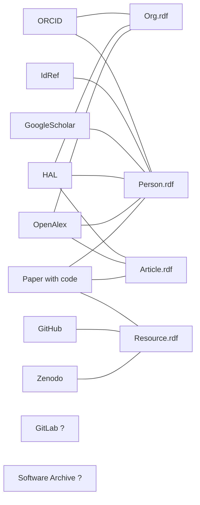
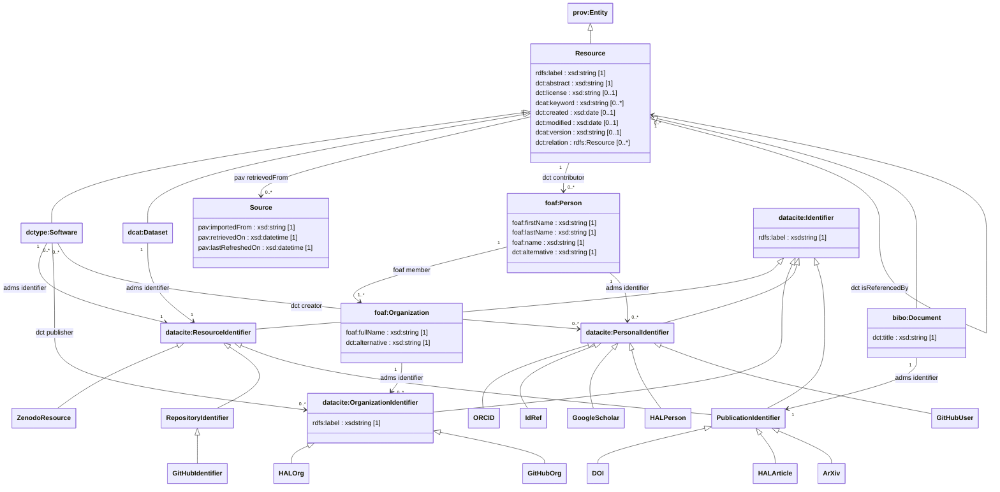

# ResearchTeamProjectFinder

The aim of this project is to create a tool able to use the different APIs available to find the public Git repositories of INRIA research teams. Further development will aim to extend this approach to all european research teams.

## Plan

Phase 1
  - HAL
    - [x] List of people
    - [x] List of organizations
    - [x] List of softwares

  - Papers with code
    - [x] List of papers and their codes

Phase 2
  - Github
    - [x] Retrieve account of known people
  - Gitlab
    - [ ] Retrieve account of known people

Phase 3
  - Consolidation
    - [ ] Removal of BNodes representing people if they can be merged into a known person
    - [ ] Removal of Github and Gitlab users that can be discarded because:
      - they are not linked to known organisations of repositories
      - they are not linked to any open source repository
Attempt to make the number of git user tend to one per person per website

Phase 4  
  - Github & GitLab
    - [ ] Retrieve repositories linked to known people
    - [ ] Retrieve repositories linked to known organizations
    - [ ] Retrieve repositories mentioning known organizations

Optional:
  - HAL
    - [ ] Scan papers abstract in search for repositories URLs
  - CrossRef
    - [ ] Scan papers abstract in search for repositories URLs

## Data

### Semantic Scholar

latest version: 2025-02-18
https://api.semanticscholar.org/datasets/v1/release/2025-02-18/dataset/papers

Waiting for an API key

### HAL

#### SPARQL
SPARQL endpoint: https://data.hal.science/doc/sparql

Research team list:

```sparql
PREFIX dct: <http://purl.org/dc/terms/>
PREFIX dc: <http://purl.org/dc/elements/1.1/>
PREFIX owl: <http://www.w3.org/2002/07/owl#>
PREFIX org: <http://www.w3.org/ns/org#>
PREFIX skos: <http://www.w3.org/2004/02/skos/core#>
PREFIX rdfs: <http://www.w3.org/2000/01/rdf-schema#>
PREFIX foaf: <http://xmlns.com/foaf/0.1/>
PREFIX halschema: <http://data.archives-ouvertes.fr/schema/>

SELECT DISTINCT ?org ?label ?acronym ?id ?superOrg {
  ?org a org:Organization ;
      skos:prefLabel ?label ;
      skos:altLabel ?acronym ;
      org:classification ?class ;
      owl:sameAs ?id 
  OPTIONAL {
    ?org org:unitOf ?superOrg .
  }
}
```

List of the names of team members:

```sparql
PREFIX org: <http://www.w3.org/ns/org#>
PREFIX skos: <http://www.w3.org/2004/02/skos/core#>
PREFIX rdfs: <http://www.w3.org/2000/01/rdf-schema#>
PREFIX foaf: <http://xmlns.com/foaf/0.1/>
PREFIX halschema: <http://data.archives-ouvertes.fr/schema/>

SELECT DISTINCT ?authorName {
  ?org org:classification <https://data.archives-ouvertes.fr/vocabulary/StructureTypeResearchteam> ;
  	skos:prefLabel ?teamLabel ;
   skos:altLabel ?altTeamLabel .

  ?author halschema:structure ?org ;
      foaf:name ?authorName .
}
ORDER BY DESC(?nom)
LIMIT 50
```

#### API

Portail INRIA: `inria`
```shell
curl "https://api.archives-ouvertes.fr/search/inria?q=*:*&rows=100&start=0&wt=json&fl=*"
```

Referential author
```shell
curl "http://api.archives-ouvertes.fr/ref/author/?q=*:*&rows=100&start=0&wt=json&fl=*"
```

Structure referential
```shell
curl "http://api.archives-ouvertes.fr/ref/structure?rows=100&start=0&wt=json&fl=*"
```

Author-structure link
```shell
curl "http://api.archives-ouvertes.fr/search/authorstructure/?firstName_t=*&lastName_t=*&rows=100&start=0&wt=json&fl=*"
```

Referential document
```shell
curl "http://api.archives-ouvertes.fr/ref/document/?q=*:*&rows=100&start=0&wt=json&fl=*"
```

### Paper with code

Download links: https://paperswithcode.com/about

### Code archive

### ORCID

XML Bulk files:
https://info.orcid.org/documentation/integration-guide/working-with-bulk-data/

Conversion from XML to JSON:
https://github.com/ORCID/orcid-conversion-lib

### BIL

Must be done manually
[BIL](https://bil.inria.fr/fr/catalog/listby/researcherWebPage)

### IdRef

Example: Author id : https://www.idref.fr/061775509
Corresponding rdf file: https://www.idref.fr/061775509.rdf

### GitHub

Search API endpoint: https://docs.github.com/en/rest/search/search?apiVersion=2022-11-28

Github python API library: https://pygithub.readthedocs.io/en/stable/github_objects.html

### Gitlab

[Gitlab](https://gitlab.inria.fr/)

```shell
curl --header "PRIVATE-TOKEN: <TOKEN>" "https://gitlab.inria.fr/api/v4/search?scope=projects&search=flight"
```


## Knowledge Graph

#### Source ogranization:



#### Schema:

##### Data:


For later: 
- Extract URLs from publications using python code
- Use of [OpenRefine](https://openrefine.org/)
  - Search for Github URLs in abstracts
- Search for DOI in GitHub READMEs ?
- Use Tesseract to find GitHub URLs in articles

Note:
- ORKG judged too poor to be used. too few Organization, schema and API inconsistent